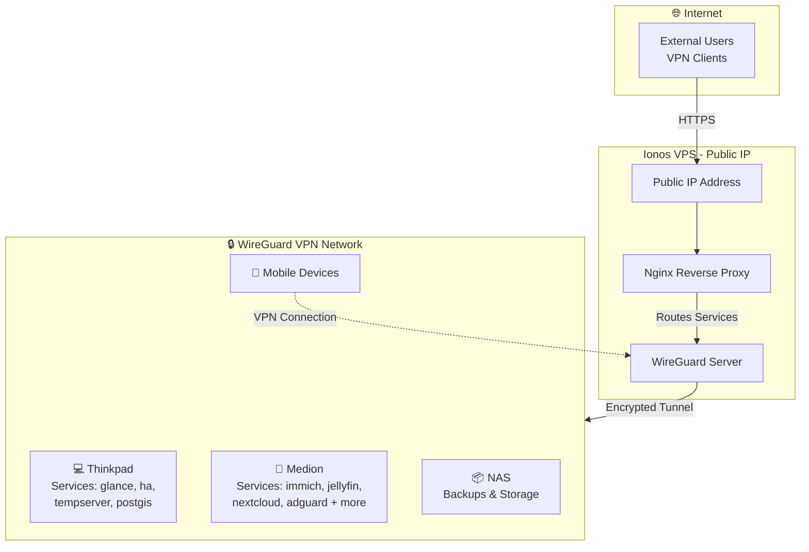

# Homelab Templates

This repository contains setup templates and configuration files for various applications running in my home lab environment. It serves as a centralized location for maintaining and versioning infrastructure-as-code configurations.

## Applications

### Thinkpad

| Group | Name | Description | Domain | Ports | Backup | Update | SSO |
| :--- | :--- | :---------- | :----- | :--- | :----: | :----: | :--: |
| **glance** | Glance | System monitoring dashboard | [home.thinkpad.lr-projects.de](https://home.thinkpad.lr-projects.de) | - | ✅ | ✅ | - |
| **ha** | Homeassistant | Home automation platform | [ha.thinkpad.lr-projects.de](https://ha.thinkpad.lr-projects.de) | - | ✅ | ✅ | ✅ |
|  | Mariadb | MariaDB database for Home Assistant | - | `3306` | ✅ | manual | - |
| **monaserver** | Stick It Server | Stick It backend | [stick-it.thinkpad.lr-projects.de](https://stick-it.thinkpad.lr-projects.de) | - | ✅ | manual | - |
|  | Minio | S3 compatible object storage | [minio.thinkpad.lr-projects.de](https://minio.thinkpad.lr-projects.de) | `9000, 9001` | ✅ | manual | - |
| **postgis** | Db | Stick It postgis database | - | `5432` | ✅ | ✅ | - |
| **tempserver** | Tempserver | Sensor Aggregation Server & UI | [temppi.thinkpad.lr-projects.de](https://temppi.thinkpad.lr-projects.de) | `8081` | ✅ | manual | - |
| **traefik** | Reverse Proxy | Traefik Reverse Proxy | [traefik.thinkpad.lr-projects.de](https://traefik.thinkpad.lr-projects.de) | `443, 80` | ✅ | ✅ | ✅ |
| **backup** | Autorestic | Automated backup solution with Restic | - | - | - | manual | - |
|  | Restic Exporter | Restic backup metrics exporter | restic-metrics.${DEVICE}.lr-projects.de | - | - | ✅ | - |
| **telegraf** | Telegraf | Telegraf monitoring agent | - | - | - | ✅ | - |
| **watchtower** | Watchtower | Automated Docker container updates | - | - | - | manual | - |

### Medion

| Group | Name | Description | Domain | Ports | Backup | Update | SSO |
| :--- | :--- | :---------- | :----- | :--- | :----: | :----: | :--: |
| **immich-app** | Immich Server | Image storage | [immich.medion.lr-projects.de](https://immich.medion.lr-projects.de) | - | ✅ | ✅ | ✅ |
|  | Immich Machine Learning | Image ML processing | - | - | ✅ | ✅ | - |
|  | Redis | - | - | - | ✅ | ✅ | - |
|  | Database | - | - | - | ✅ | ✅ | - |
|  | Immich Kiosk | Diashow for digital picture frame | [diashow.medion.lr-projects.de](https://diashow.medion.lr-projects.de) | - | ✅ | ✅ | ✅ |
| **jellyfin** | Jellyfin | Movie storage | [jellyfin.medion.lr-projects.de](https://jellyfin.medion.lr-projects.de) | `8096` | ✅ | ✅ | ✅ |
| **logging** | Influxdb | Time-series database | [influx.medion.lr-projects.de](https://influx.medion.lr-projects.de) | - | ✅ | ✅ | - |
|  | Grafana | Alerting and monitoring of metric data | [grafana.medion.lr-projects.de](https://grafana.medion.lr-projects.de) | - | ✅ | ✅ | ✅ |
|  | Prometheus | Metric collection and alerting | [prometheus.medion.lr-projects.de](https://prometheus.medion.lr-projects.de) | - | ✅ | ✅ | - |
|  | Uptime Kuma | Uptime monitoring | [uptime.medion.lr-projects.de](https://uptime.medion.lr-projects.de) | - | ✅ | ✅ | ✅ |
| **nextcloud** | Nextcloud | File sharing and collaboration | [nextcloud.medion.lr-projects.de](https://nextcloud.medion.lr-projects.de) | - | ✅ | ✅ | ✅ |
|  | Database | - | - | - | ✅ | ✅ | - |
|  | Redis | LibreOffice Online | [office.medion.lr-projects.de](https://office.medion.lr-projects.de) | - | ✅ | ✅ | - |
| **pdf** | Stirling Pdf | PDF processing | [pdf.lr-projects.de](https://pdf.lr-projects.de) | - | - | manual | - |
| **pocket-id** | Pocket Id | SSO solution | [sso.medion.lr-projects.de](https://sso.medion.lr-projects.de) | - | ✅ | ✅ | - |
| **stick-it-homepage** | App | Landing page of the Stick-It app | [stick-it-home.medion.lr-projects.de](https://stick-it-home.medion.lr-projects.de) | - | ✅ | manual | - |
| **traefik** | Reverse Proxy | Reverse Proxy (with https) | [traefik.medion.lr-projects.de](https://traefik.medion.lr-projects.de) | `443, 80` | ✅ | ✅ | ✅ |
| **adguard** | Adguardhome | DNS for home network | dns.${DEVICE}.lr-projects.de | `53` | - | ✅ | ✅ |
|  | Adguard Exporter | AdGuard Home metrics exporter | - | - | - | manual | - |
| **backup** | Autorestic | Automated backup solution with Restic | - | - | - | manual | - |
|  | Restic Exporter | Restic backup metrics exporter | restic-metrics.${DEVICE}.lr-projects.de | - | - | ✅ | - |
| **telegraf** | Telegraf | Telegraf monitoring agent | - | - | - | ✅ | - |
| **watchtower** | Watchtower | Automated Docker container updates | - | - | - | manual | - |

### Ionos

| Group | Name | Description | Domain | Ports | Backup | Update | SSO |
| :--- | :--- | :---------- | :----- | :--- | :----: | :----: | :--: |
| **pi-hole** | Pihole | DNS for vpn network | - | `4080, 53` | - | ✅ | ✅ |
|  | Pihole Influxdb | Pi-hole metrics exporter to InfluxDB | - | - | - | ✅ | - |
| **traefik** | Traefik | Reverse Proxy (with https) | - | `443, 80` | - | ✅ | ✅ |
|  | Crowdsec | Security monitoring | - | - | - | manual | - |
| **adguard** | Adguardhome | DNS for home network | dns.${DEVICE}.lr-projects.de | `53` | - | ✅ | ✅ |
|  | Adguard Exporter | AdGuard Home metrics exporter | - | - | - | manual | - |
| **telegraf** | Telegraf | Telegraf monitoring agent | - | - | - | ✅ | - |
| **watchtower** | Watchtower | Automated Docker container updates | - | - | - | manual | - |

## Homelab setup

The homelab uses a WireGuard VPN hosted on an Ionos VPS with a public IP to securely connect remote devices (thinkpad, medion, NAS, and mobile devices) in a private network. Services run on the thinkpad and medion laptops in my parents basement.

**Internet Access:** External clients connect via HTTPS to the public IP, where a Traefik reverse proxy routes requests to services running on the internal devices over the encrypted VPN tunnel.

**Internal Access:** Clients connected to the VPN can directly access services without going through the reverse proxy, providing access to services that are not reachable from the outside.

Network Architecture:

## Purpose

The goal of this repository is to:
- Maintain version control of configuration files
- Document setup procedures
- Backup setup procedures
- Share deployment configs with friends :)

## Getting Started

Each application folder contains the used setup (mostly docker-compose.yml) and the used configuration files with exempted secrets.
