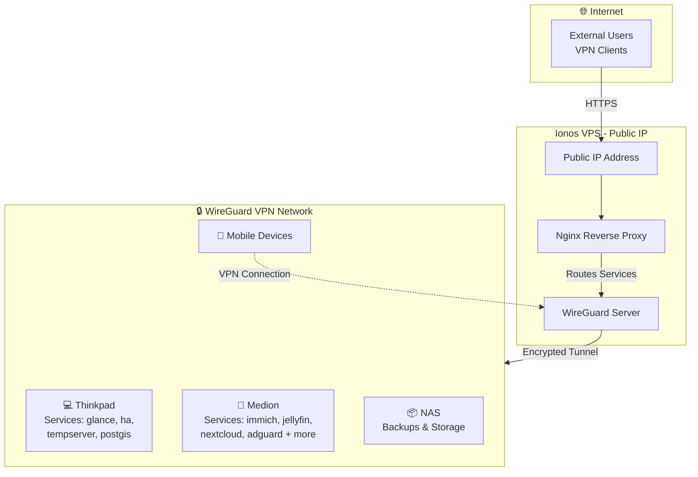

# Homelab Templates

This repository contains setup templates and configuration files for various applications running in my home lab environment. It serves as a centralized location for maintaining and versioning infrastructure-as-code configurations.

## Applications

### Thinkpad

| Group | Name  | Domain | Ports | Backup | Update | SSO |
| :--- | :---  | :----- | :--- | :----: | :----: | :--: |
| **glance** | Glance | [home](https://home.thinkpad.lr-projects.de) | - | ✅ | ✅ | - |
| **ha** | Homeassistant | [ha](https://ha.thinkpad.lr-projects.de) | - | ✅ | ✅ | ✅ |
|  | Mariadb | - | `3306` | ✅ | manual | - |
| **monaserver** | Stick It Server | [stick-it](https://stick-it.thinkpad.lr-projects.de) | - | ✅ | manual | - |
|  | Minio | [minio](https://minio.thinkpad.lr-projects.de), [minio-admin](https://minio-admin.thinkpad.lr-projects.de) | `9000, 9001` | ✅ | manual | - |
| **postgis** | Db | - | - | ✅ | ✅ | - |
| **tempserver** | Tempserver | [temppi](https://temppi.thinkpad.lr-projects.de) | `8081` | ✅ | manual | - |
| **traefik** | Reverse Proxy | [traefik](https://traefik.thinkpad.lr-projects.de) | `443, 80` | ✅ | ✅ | ✅ |
| **backup** | Autorestic | - | - | - | manual | - |
|  | Restic Exporter | [restic-metrics](https://restic-metrics.thinkpad.lr-projects.de) | - | - | ✅ | - |
| **telegraf** | Telegraf | - | - | - | ✅ | - |
| **watchtower** | Watchtower | - | - | - | manual | - |

### Medion

| Group | Name  | Domain | Ports | Backup | Update | SSO |
| :--- | :---  | :----- | :--- | :----: | :----: | :--: |
| **immich-app** | Immich Server | [immich](https://immich.medion.lr-projects.de) | - | ✅ | ✅ | ✅ |
|  | Immich Machine Learning | - | - | ✅ | ✅ | - |
|  | Redis | - | - | ✅ | ✅ | - |
|  | Database | - | - | ✅ | ✅ | - |
|  | Immich Kiosk | [diashow](https://diashow.medion.lr-projects.de) | - | ✅ | ✅ | ✅ |
| **jellyfin** | Jellyfin | [jellyfin](https://jellyfin.medion.lr-projects.de) | `8096` | ✅ | ✅ | ✅ |
| **logging** | Influxdb | [influx](https://influx.medion.lr-projects.de) | - | ✅ | ✅ | - |
|  | Grafana | [grafana](https://grafana.medion.lr-projects.de) | - | ✅ | ✅ | ✅ |
|  | Prometheus | [prometheus](https://prometheus.medion.lr-projects.de) | - | ✅ | ✅ | - |
|  | Uptime Kuma | [uptime](https://uptime.medion.lr-projects.de) | - | ✅ | ✅ | ✅ |
| **nextcloud** | Nextcloud | [nextcloud](https://nextcloud.medion.lr-projects.de) | - | ✅ | ✅ | ✅ |
|  | Database | - | - | ✅ | ✅ | - |
|  | Redis | [office](https://office.medion.lr-projects.de) | - | ✅ | ✅ | - |
| **pdf** | Stirling Pdf | [pdf](https://pdf.lr-projects.de) | - | - | manual | - |
| **pocket-id** | Pocket Id | [sso](https://sso.medion.lr-projects.de) | - | ✅ | ✅ | - |
| **stick-it-homepage** | App | [stick-it-home](https://stick-it-home.medion.lr-projects.de) | - | ✅ | manual | - |
| **traefik** | Reverse Proxy | [traefik](https://traefik.medion.lr-projects.de) | `443, 80` | ✅ | ✅ | ✅ |
| **adguard** | Adguardhome | [dns](https://dns.medion.lr-projects.de) | `53` | - | ✅ | ✅ |
|  | Adguard Exporter | - | - | - | manual | - |
| **backup** | Autorestic | - | - | - | manual | - |
|  | Restic Exporter | [restic-metrics](https://restic-metrics.medion.lr-projects.de) | - | - | ✅ | - |
| **telegraf** | Telegraf | - | - | - | ✅ | - |
| **watchtower** | Watchtower | - | - | - | manual | - |

### Ionos

| Group | Name  | Domain | Ports | Backup | Update | SSO |
| :--- | :---  | :----- | :--- | :----: | :----: | :--: |
| **pi-hole** | Pihole | - | `4080, 53` | - | ✅ | ✅ |
|  | Pihole Influxdb | - | - | - | ✅ | - |
| **traefik** | Traefik | - | `443, 80` | - | ✅ | ✅ |
|  | Crowdsec | - | - | - | manual | - |
| **adguard** | Adguardhome | [dns](https://dns.ionos.lr-projects.de) | `53` | - | ✅ | ✅ |
|  | Adguard Exporter | - | - | - | manual | - |
| **telegraf** | Telegraf | - | - | - | ✅ | - |
| **watchtower** | Watchtower | - | - | - | manual | - |

## Homelab setup

The homelab uses a WireGuard VPN hosted on an Ionos VPS with a public IP to securely connect remote devices (thinkpad, medion, NAS, and mobile devices) in a private network. Services run on the thinkpad and medion laptops in my parents basement.

**Internet Access:** External clients connect via HTTPS to the public IP, where a Traefik reverse proxy routes requests to services running on the internal devices over the encrypted VPN tunnel.

**Internal Access:** Clients connected to the VPN can directly access services without going through the reverse proxy, providing access to services that are not reachable from the outside.

Network Architecture:

## Purpose

The goal of this repository is to:
- Maintain version control of configuration files
- Document setup procedures
- Backup setup procedures
- Share deployment configs with friends :)

## Getting Started

Each application folder contains the used setup (mostly docker-compose.yml) and the used configuration files with exempted secrets.
