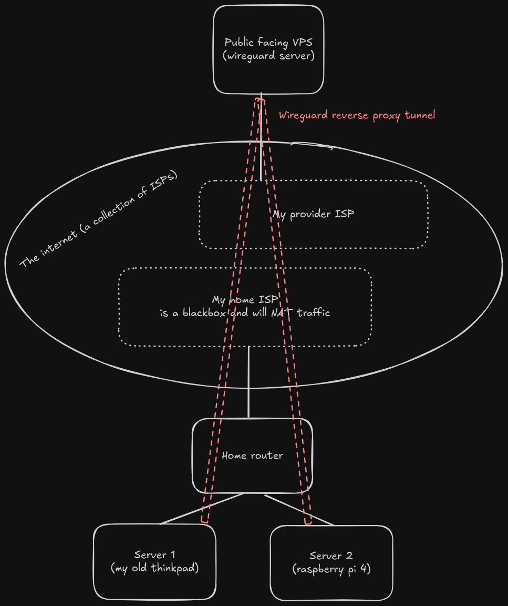

# Homelab Templates

This repository contains setup templates and configuration files for various applications running in my home lab environment. It serves as a centralized location for maintaining and versioning infrastructure-as-code configurations.

## Applications

### Thinkpad

| Name                 | Description                    | Domain                          | Backup Solution | Update Solution                   | SSO Integration                    |
| -------------------- | ------------------------------ | ------------------------------- | --------------- | --------------------------------- | ---------------------------------- |
| Bitwarden            | Password manager               | bitwarden.lr-projects.de        | ✅         | `cron`                            | must be standalone                 |
| Glance               | System monitoring dashboard    | home.lr-projects.de             | ✅         | `watchtower` - tag: `latest`      | -                                  |
| Home Assistant       | Home automation platform       | ha.thinkpad.lr-projects.de      | ✅         | `watchtower` - tag: `stable`      | ✅                                  |
| Telegraf             | Metric collector               | -                               | -               | `watchtower` - tag: `1.31-alpine` | -                                  |
| Nextcloud            | File sharing and collaboration | nextcloud.lr-projects.de        | ✅         | `watchtower` - tag: `latest`      | ✅                                  |
| Nextcloud (MariaDB)  | Nextcloud database             | -                               | ✅         | `watchtower` - tag: `lts`         | -                                  |
| Nextcloud (Redis)    | Nextcloud in-memory db         | -                               | -               | `watchtower` - tag: `latest`      | -                                  |
| Monaserver           | Stick It backend               | stick-it.lr-projects.de         | ✅          | `manual`                          | ❌ (not supported by me)                 |
| Monaserver (Postgis) | Stick It postgis database      | -                               | ✅          | `manual`                          | -                                  |
| Monaserver (Minio)   | Stick It image bucket          | minio.thinkpad.lr-projects.de   | ✅          | `manual`                          | ❌ (community edition not possible) |
| Traefik              | Reverse Proxy (with https)     | traefik.thinkpad.lr-projects.de | ✅          | `watchtower` - tag: `v3`          | ✅  (via Traefik OIDC)             |
| Temppi               | Sensor Aggregation Server & UI | temmpi.thinkpad.lr-projects.de  | ✅ (only config) | `manual`                      | -                                 |
| Watchtower           | Docker image updater           | -                               | -               | `manual`                          | -                                  |

### Medion

| Name              | Description                           | Domain                         | Backup Solution   | Update Solution                   | SSO Integration                    |
| ----------------- | ------------------------------------- | ------------------------------ | ----------------- | --------------------------------- | ---------------------------------- |
| Immich            | Image storage                         | immich.medion.lr-projects.de   | ✅                | `watchtower` - tag: `release`     | ✅                                  |
| Jellyfin          | Movie storage                         | jellyfin.medion.lr-projects.de | ✅ (only config)  | `watchtower` - tag: `latest`      | ✅                                  |
| Pocket-ID         | SSO solution                          | sso.medion.lr-projects.de      | ✅                | `watchtower` - tag: `v1`          | - (is the SSO)                      |
| Pi-Hole           | DNS for home network                  | pihole.medion.lr-projects.de   | ✅                | `watchtower` - tag: `latest`      | ✅ (via Traefik OIDC)                |
| Pi-Hole influxDB  | Sidecar for pi-hole metric collection | -                              | -                 | `watchtower` - tag: `latest`      | -                                   |
| Traefik           | Reverse Proxy (with https)            | traefik.medion.lr-projects.de  | ✅                | `watchtower` - tag: `v3`          | ✅ (via Traefik OIDC)               |
| Telegraf          | Metric collector                      | -                              | -                 | `watchtower` - tag: `1.31-alpine` | -                                  |
| InfluxDB          | Time-series database                  | influx.medion.lr-projects.de   | ✅ (only config)  | `watchtower` - tag: `2.6-ubuntu`  | ❌ (community edition not possible) |
| Grafana           | Alerting and montoring of metric data | grafana.medion.lr-projects.de  | ✅                | `watchtower` - tag: `latest`      | ✅                                  |
| Portfolio         | Homepage of lr-projects               | lr-projects.de                 | ✅                | `manual`                          | -                                  |
| Stick-It Homepage | Landing page of the Stick-It app      | stick-it-map.lr-projects.de    | ✅                | `manual`                          | -                                  |
| Watchtower           | Docker image updater           | -                               | -               | `manual`                          | -                                  |

### Ionos

| Name     | Description                | Device | Domain                       | Backup Solution | Update Solution          | SSO Integration |
| -------- | -------------------------- | ------ | ---------------------------- | --------------- | ------------------------ | --------------- |
| Traefik  | Reverse Proxy (with https) | Ionos  | traefik.ionos.lr-projects.de | ❌               | `watchtower` - tag: `v3` | ✅ (via Traefik OIDC)    |
| Pi-Hole  | DNS for vpn network        | Ionos  | pi-hole.ionos.lr-projects.de | ❌               | `watchtower` - tag: `latest`    | ✅ (via Traefik OIDC)     |
| Pi-Hole influxDB  | Sidecar for pi-hole metric collection | -                              | -                 | `watchtower` - tag: `latest`      | -                                   |
| Telegraf | Metric collector           | Ionos  | -                            | -               | `watchtower` - tag: `telegraf:1.31-alpine`  | -               |
| Watchtower           | Docker image updater           | -                               | -               | `manual`                          | -                                  |

## Homelab setup

A wireguard server, running on a very cheap VPS with a public IP, is used to connect all devices in the homelab.
This allows for (reverse) proxying of services running on the homelab to VPN clients. 
This also allows for the nginx proxy, running on the public VPS, to expose specific services to the internet.

## Purpose

The goal of this repository is to:
- Maintain version control of configuration files
- Document setup procedures
- Enable quick recovery/redeployment of services
- Share configurations across different environments

## Getting Started

Each application folder contains the used setup (mostly docker-compose.yml) and the used configuration files with exempted secrets.
