# Homelab Templates

This repository contains setup templates and configuration files for various applications running in my home lab environment. It serves as a centralized location for maintaining and versioning infrastructure-as-code configurations.

## Applications

### Thinkpad

| Name | Description | Domain | Backup | Update | SSO |
| ---- | ----------- | ------ | ------ | ------ | --- |
| Glance | System monitoring dashboard | home.thinkpad.lr-projects.de | ✅ | ✅ `watchtower` | - |
| Homeassistant | Home automation platform | ha.thinkpad.lr-projects.de | ✅ | ✅ `watchtower` | ✅ |
| Mariadb | MariaDB database for Home Assistant | - | ✅ | manual | - |
| Stick It Server | Stick It backend | stick-it.thinkpad.lr-projects.de | ✅ | manual | - |
| Minio | S3 compatible object storage | minio.thinkpad.lr-projects.de | ✅ | manual | - |
| Db | Stick It postgis database | - | ✅ | ✅ `watchtower` | - |
| Tempserver | Sensor Aggregation Server & UI | temppi.thinkpad.lr-projects.de | ✅ | manual | - |
| Reverse Proxy | Traefik Reverse Proxy | traefik.thinkpad.lr-projects.de | ✅ | ✅ `watchtower` | ✅ |

### Medion

| Name | Description | Domain | Backup | Update | SSO |
| ---- | ----------- | ------ | ------ | ------ | --- |
| Adguardhome | DNS for home network | dns.medion.lr-projects.de | ✅ | ✅ `watchtower` | ✅ |
| Adguard Exporter | AdGuard Home metrics exporter | - | ✅ | manual | - |
| Immich Server | Image storage | immich.medion.lr-projects.de | ✅ | ✅ `watchtower` | ✅ |
| Immich Machine Learning | Image ML processing | - | ✅ | ✅ `watchtower` | - |
| Redis | - | - | ✅ | ✅ `watchtower` | - |
| Database | - | - | ✅ | ✅ `watchtower` | - |
| Immich Kiosk | Diashow for digital picture frame | diashow.medion.lr-projects.de | ✅ | ✅ `watchtower` | ✅ |
| Jellyfin | Movie storage | jellyfin.medion.lr-projects.de | ✅ | ✅ `watchtower` | ✅ |
| Influxdb | Time-series database | influx.medion.lr-projects.de | ✅ | ✅ `watchtower` | - |
| Grafana | Alerting and monitoring of metric data | grafana.medion.lr-projects.de | ✅ | ✅ `watchtower` | ✅ |
| Prometheus | Metric collection and alerting | prometheus.medion.lr-projects.de | ✅ | ✅ `watchtower` | - |
| Uptime Kuma | Uptime monitoring | uptime.medion.lr-projects.de | ✅ | ✅ `watchtower` | ✅ |
| Nextcloud | File sharing and collaboration | nextcloud.medion.lr-projects.de | ✅ | ✅ `watchtower` | ✅ |
| Database | - | - | ✅ | ✅ `watchtower` | - |
| Redis | LibreOffice Online | office.medion.lr-projects.de | ✅ | ✅ `watchtower` | - |
| Stirling Pdf | PDF processing | pdf.lr-projects.de | - | manual | - |
| Pocket Id | SSO solution | sso.medion.lr-projects.de | ✅ | ✅ `watchtower` | - |
| App | Landing page of the Stick-It app | stick-it-home.medion.lr-projects.de | ✅ | manual | - |
| Reverse Proxy | Reverse Proxy (with https) | traefik.medion.lr-projects.de | ✅ | ✅ `watchtower` | ✅ |

### Ionos

| Name | Description | Domain | Backup | Update | SSO |
| ---- | ----------- | ------ | ------ | ------ | --- |
| Adguardhome Ionos | DNS for home network | - | - | ✅ `watchtower` | - |
| Adguard Exporter | AdGuard Home metrics exporter | - | - | manual | - |
| Pihole | DNS for vpn network | - | - | ✅ `watchtower` | ✅ |
| Pihole Influxdb | Pi-hole metrics exporter to InfluxDB | - | - | ✅ `watchtower` | - |
| Traefik | Reverse Proxy (with https) | - | - | ✅ `watchtower` | ✅ |
| Crowdsec | Security monitoring | - | - | manual | - |

### Shared

| Name | Description | Domain | Backup | Update | SSO |
| ---- | ----------- | ------ | ------ | ------ | --- |
| Autorestic | Automated backup solution with Restic | - | - | manual | - |
| Restic Exporter | Restic backup metrics exporter | restic-metrics.${DEVICE}.lr-projects.de | - | ✅ `watchtower` | - |
| Telegraf | Telegraf monitoring agent | - | - | ✅ `watchtower` | - |
| Watchtower | Automated Docker container updates | - | - | manual | - |

## Homelab setup

The homelab uses a WireGuard VPN hosted on an Ionos VPS with a public IP to securely connect remote devices (thinkpad, medion, NAS, and mobile devices) in a private network. Services run on the thinkpad and medion laptops in my parents basement.

**Internet Access:** External clients connect via HTTPS to the public IP, where a Traefik reverse proxy routes requests to services running on the internal devices over the encrypted VPN tunnel.

**Internal Access:** Clients connected to the VPN can directly access services without going through the reverse proxy, providing access to services that are not reachable from the outside.

Network Architecture:

```mermaid
graph TB
    subgraph Internet["🌐 Internet"]
        Users["External Users<br/>VPN Clients"]
    end
    
    subgraph Ionos["Ionos VPS - Public IP"]
        PublicIP["Public IP Address"]
        WGServer["WireGuard Server"]
        NginxProxy["Nginx Reverse Proxy"]
    end
    
    subgraph VPN["🔒 WireGuard VPN Network"]
        TP["💻 Thinkpad<br/>Services: glance, ha,<br/>tempserver, postgis"]
        MD["💾 Medion<br/>Services: immich, jellyfin,<br/>nextcloud, adguard + more"]
        NAS["📦 NAS<br/>Backups & Storage"]
        Mobile["📱 Mobile Devices"]
    end
    
    Users -->|HTTPS| PublicIP
    PublicIP --> NginxProxy
    NginxProxy -->|Routes Services| WGServer
    WGServer -->|Encrypted Tunnel| VPN
    Mobile -.->|VPN Connection| WGServer
```

## Purpose

The goal of this repository is to:
- Maintain version control of configuration files
- Document setup procedures
- Backup setup procedures
- Share deployment configs with friends :)

## Getting Started

Each application folder contains the used setup (mostly docker-compose.yml) and the used configuration files with exempted secrets.
