# Homelab Templates

This repository contains setup templates and configuration files for various applications running in my home lab environment. It serves as a centralized location for maintaining and versioning infrastructure-as-code configurations.

## Applications

{{tables}}

## Homelab setup

The homelab uses a WireGuard VPN hosted on an Ionos VPS with a public IP to securely connect remote devices (thinkpad, medion, NAS, and mobile devices) in a private network. Services run on the thinkpad and medion laptops in my parents basement.

**Internet Access:** External clients connect via HTTPS to the public IP, where a Traefik reverse proxy routes requests to services running on the internal devices over the encrypted VPN tunnel.

**Internal Access:** Clients connected to the VPN can directly access services without going through the reverse proxy, providing access to services that are not reachable from the outside.

Network Architecture:

```mermaid
graph TB
    subgraph Internet["🌐 Internet"]
        Users["External Users<br/>VPN Clients"]
    end
    
    subgraph Ionos["Ionos VPS - Public IP"]
        PublicIP["Public IP Address"]
        WGServer["WireGuard Server"]
        NginxProxy["Nginx Reverse Proxy"]
    end
    
    subgraph VPN["🔒 WireGuard VPN Network"]
        TP["💻 Thinkpad<br/>Services: glance, ha,<br/>tempserver, postgis"]
        MD["💾 Medion<br/>Services: immich, jellyfin,<br/>nextcloud, adguard + more"]
        NAS["📦 NAS<br/>Backups & Storage"]
        Mobile["📱 Mobile Devices"]
    end
    
    Users -->|HTTPS| PublicIP
    PublicIP --> NginxProxy
    NginxProxy -->|Routes Services| WGServer
    WGServer -->|Encrypted Tunnel| VPN
    Mobile -.->|VPN Connection| WGServer
```

## Purpose

The goal of this repository is to:
- Maintain version control of configuration files
- Document setup procedures
- Backup setup procedures
- Share deployment configs with friends :)

## Getting Started

Each application folder contains the used setup (mostly docker-compose.yml) and the used configuration files with exempted secrets.
